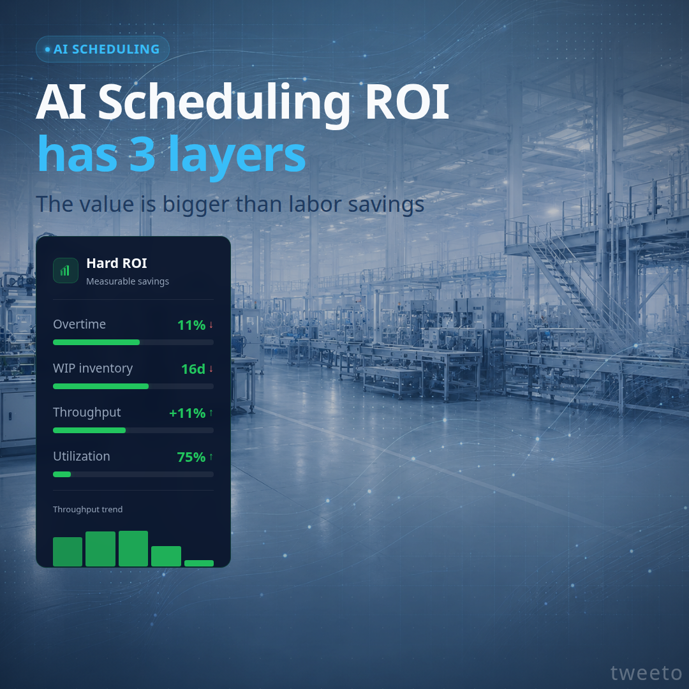

# template-roi-dashboard

A [Remotion](https://www.remotion.dev/) template for animated ROI dashboard videos: three metric cards (Hard, Operational, Strategic) animate in sequentially with live counters, progress bars, and a sweep-line reveal — all on a dark tech background.

<p align="center">
  <a href="assets/template01.png"></a>
  <a href="assets/template02.png"></a>
  <br/>
  <a href="assets/template03.png"></a>
  <a href="assets/template04.png"></a>
</p>

## Using with an AI agent

Give this single line to Claude Code, Gemini, Codex, or any coding agent and it will know exactly what to do:

```
Clone https://github.com/davidtweeto/template-roi-dashboard, run npm install, then edit the defaultProps in src/Root.tsx to set your badge, header text, card titles, KPI labels/values, and footer text, and run npm run dev to preview in Remotion Studio.
```

For best results, also install the Remotion skill so your agent has deep Remotion domain knowledge:

```bash
npx skills add remotion-dev/skills
```

## Quick start

```bash
npm install
npm run dev
```

Open [http://localhost:3000](http://localhost:3000) in your browser to preview in Remotion Studio.

<p align="center">
  <a href="assets/RemotionStudio01.png"></a>
</p>

## Customizing content

All composition props are editable live in Remotion Studio via the Props panel. The schema is defined in `src/Composition.tsx` using Zod. Edit `defaultProps` in `src/Root.tsx` to set your own content:

| Prop group | What it controls |
|---|---|
| `badge` | Top badge text (e.g. "AI SCHEDULING") |
| `header` | Title line 1, title line 2 (shown in cyan), subtitle |
| `hardROI` | Card title/subtitle, 4 KPI rows (label, from/to values, unit, direction, bar scale) |
| `operationalROI` | Card title/subtitle, 3 stability bars, schedule adherence row |
| `strategicROI` | Card title/subtitle, 4 KPI label rows, network chart label |
| `footer` | Tagline text and badge text |
| `watermark` | Watermark text (bottom-right corner, set to `""` to hide) |
| `backgroundFile` | Filename inside `public/` (or `""` for no image) |

### KPI direction

Each KPI row and stability bar has a `direction` field: `"up"` shows an upward arrow in green/amber, `"down"` shows a downward arrow in red. Use `"down"` for metrics that improve by decreasing (e.g. overtime, error rate).

## Adding a background image

A default `bg.png` is included in `public/`. To use your own image, drop it into `public/` and update `backgroundFile` in `src/Root.tsx`:

```ts
backgroundFile: "my-photo.jpg",
```

If `backgroundFile` is empty, the dark gradient background is used alone.

## Rendering

```bash
# Render the full video
npm run render

# Render a single frame for layout checks
npx remotion still ROIDashboard --frame=60 --scale=0.5
```

Output lands in `out/`.

## Animation sequence

The video runs at 30 fps for 360 frames (12 seconds):

| Time | Event |
|---|---|
| 0s | Background fades in, header slides up |
| 2s | Hard ROI card slides up, KPI counters animate |
| 4s | Operational ROI card slides up with chaos/stability sequence |
| 7s | Strategic ROI card slides up, KPI labels appear |
| 9s | Footer slides up, sweep-line races across all cards |
| 11s | Pulse flash + fade-to-black outro |

## Structure

```
src/
  index.ts              — Remotion entry point
  Root.tsx              — Composition registration & default props
  Composition.tsx       — Main component + Zod schema (ROIDashboardSchema)
  constants.ts          — Shared colors and layout constants
  components/
    Background.tsx      — Background image + gradient overlays
    Header.tsx          — Badge, title, subtitle
    HardROICard.tsx     — Green KPI counters with progress bars
    OperationalROICard.tsx — Amber stability bars with chaos animation
    StrategicROICard.tsx   — Cyan KPI labels with node network
    Footer.tsx          — Tagline, badge, sweep-line effect
public/
  bg.png                — Default background image
```

## Built with Remotion

This template is built on [Remotion](https://www.remotion.dev/) — a framework for creating videos programmatically in React.

- Website: [remotion.dev](https://www.remotion.dev/)
- GitHub: [github.com/remotion-dev/remotion](https://github.com/remotion-dev/remotion)
